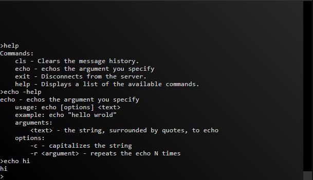

# MaintCLI
Presents a command-line interface to your app that is accessible via a web-browser.



### Features:
* Define commands in the application, and handle them a/synchronously.
* Send asynchronous messages to connected clients.
* Modifiable appearance: Font/color, Background color/image/gradient.
* ILogger/ILoggerProvider implementations for use as a logging target.
* Supports HTTPS and basic authentication.
* Usable within any C# application type. No need for IIS, etc.

### Installation
Install the package _MaintCLI_ from Nuget.org. Or, from the package manager console:
```
PM> Install-Package MaintCLI
```

### Usage

To publish the interface, you can call _Start()_ on the default static instance:
```CSharp
MaintCli.Default.Start(httpEndPoint: new IPEndPoint(IPAddress.Any, 5000));
``` 
<br/>

To add a command:
```CSharp
MaintCli.Default.AddCommand(
  new CommandBuilder("echo", "echos the argument you specify", "echo \"hello wrold\"")
	.AddArgument("text", "the string, surrounded by quotes, to echo")
	.Execute((sender, args) =>
	{
	  MaintCli.Default.SendMessageTo(sender, args["text"]);
	})
	.Build());
``` 
See [SimpleTest](/SimpleTest/Program.cs) for a more feature-complete example.
<br/>
